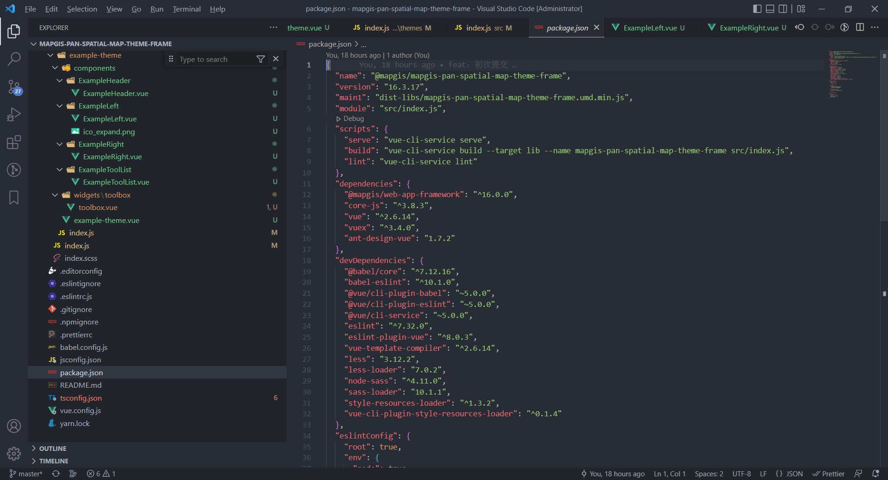
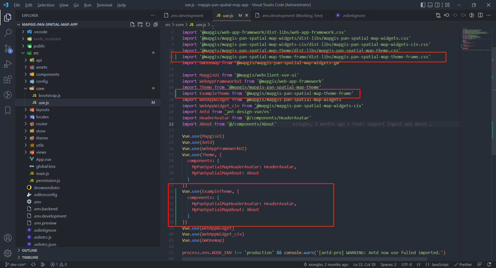

# 目录结构

```plain
|── src
   |── components                           # 通用组件
      |── Footer                            # footer组件,页面底部
      |── Header                            # 页面顶部组件
      |── SideMenu                          # 左右菜单组件
      |── SidePanel                         # 左右面板组件
      |── ToolbarButton                     # 工具条按钮组件
      |── ToolbarCard                       # 工具条面板
      |── ToolBox                           # 工具盒
      |── index.js                          # components入口文件
   |── theme                                # 主题样式
      |── antd                              # antd样式
      |── default                           # 默认样式
      |── mapgis-ui                         # mapgis-ui样式
      |── index.less                        # 样式入口文件
      |── theme.less                        # 样式入口文件
   |── themes                               # 主题
      |── classic-theme-dcd                 # dcd主题
         |── components                     # dcd主题组件
            |── ClassicHeader               # dcd主题顶部组件
            |── ClassicLeft                 # dcd主题左侧组件
            |── ClassicRight                # dcd主题右侧组件
            |── ClassicToolList             # dcd主题工具列表组件
         |── classic-theme.vue              # dcd主题主组件
      |── index.js                          # themes入口文件
   |── index.js                             # 项目入口文件
   |── index.scss                           # 项目样式文件
|── .editorconfig                           # editor配置
|── .eslintignore                           # ESlint忽略路径
|── .eslintrc.js                            # ESlint配置
|── .gitignore                              # GIT忽略路径
|── .prettierrc                             # 代码格式化配置
|── babel.config.js                         # babel配置文件
|── jsconfig.json                           # js配置
|── package.json                            # npm脚本和依赖项
|── README.md                               # 您的网站/应用程序的自述文件
|── tsconfig.json                           # ts配置
|── vue.config.js                           # vue配置文件
```

# 安装依赖及打包

从 GitLab 上拉取 mapgis-pan-spatial-map-theme-frame 代码，执行 yarn 命令安装依赖

```
yarn
```

执行 yarn build 命令进行打包，打包后文件输出至 dist-libs 目录下

```
yarn build
```


# 引入方式

支持 src 引入及 dist-libs 两种引入方式，默认情况下为 dist-libs 引入。如需修改为 src 引入方式，可在 package.json 文件当中修改"main"为"main1"，"module1"为"module"，以下截图方式。**src 方式引入，方便调试，发布请使用 dist-libs 的方式引入**，即修改"main1"为"main"，"module"为"module1"。



# 运行程序

1、在 mapgis-pan-spatial-map-mock-server 目录下执行 yarn mock 命令

```
yarn mock
```

2、在 mapgis-pan-spatial-map-theme-frame 目录下执行 yarn link 命令

```
yarn link
```

3、在 mapgis-pan-spatial-map-app 目录下执行 yarn link @mapgis/mapgis-pan-spatial-map-theme-frame

```
yarn link @mapgis/mapgis-pan-spatial-map-theme-frame
```

4、在 mapgis-pan-spatial-map-app/src/core/use.js 中引入@mapgis/mapgis-pan-spatial-map-theme-frame，并Vue.use引入的库。如果有样式文件还需引入样式文件，import '@mapgis/mapgis-pan-spatial-map-theme-frame/dist-libs/mapgis-pan-spatial-map-theme-frame.css'



5、在 mapgis-pan-spatial-map-app 目录下执行 yarn serve 命令

```
yarn serve
```

在前台页面可以看见主题显示效果。


# 主题扩展指南

详见 [主题扩展指南](./docs/主题扩展指南.md)

