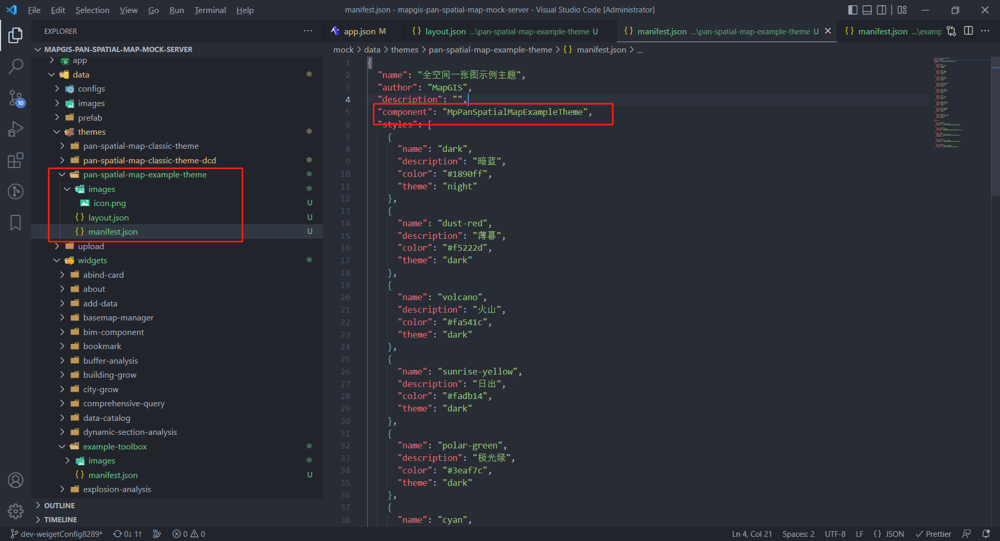
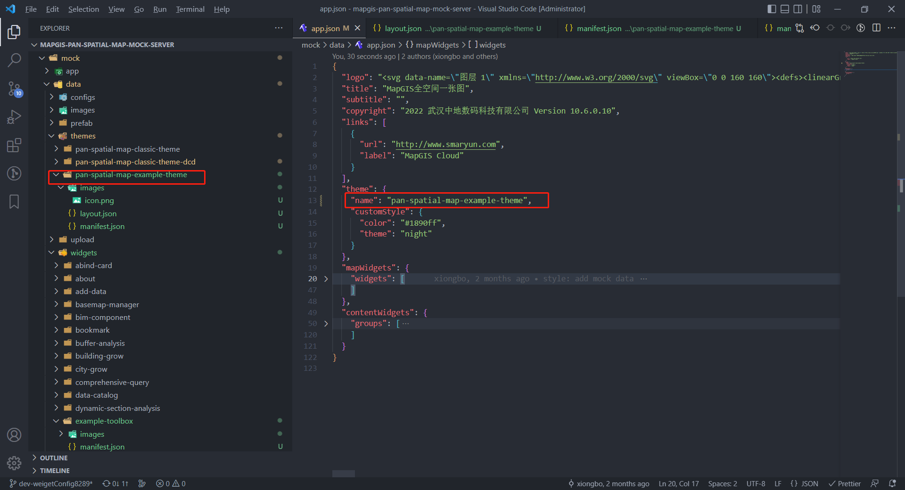

# 主题规范

主题是一个用户界面元素集合，它定义了 App 的外观，布局，app 导航，和 map 上基础 UI 组件（比如：比例尺、鹰眼图等）。
通过主题，可以打造个性化的应用界面、用户交互体验、和品牌样式。
主题元素主要包括：widgetpanel、style、布局。

| 主题元素 | 定义                                                         |
| -------- | ------------------------------------------------------------ |
| Panel    | Panel 是展示 widget 内容的 UI 窗口。可以定制特定主题上，具有特殊功能和样式的 Panel。比如：你可以开发一个可以在屏幕上随意拖动，并且拥有紫色主题样式的 Panel。通过主题 Panel，widget 开发者可以集中在开发 widget 内部功能，而不用担心 widget 怎么展示。一个主题可以包含多个 Panels。 |
| 样式     | 一个主题可以包含多个样式。                                   |
| 布局     | 本质上来说，布局是一种规定 UI 元素在屏幕上的位置的 app 配置。 |

## 主题 manifest

```javascript
{
  // theme的名称
  "name": "全空间一张图示例主题",
  // theme的作者
  "author": "MapGIS",
  // theme的描述
  "description": "",
  // theme的组件名，在定义的主题包里，比如@mapgis/mapgis-pan-spatial-map-theme-frame
  "component": "MpPanSpatialMapExampleTheme",

  // theme的样式集合
  "styles": [
     {
       // 样式名称
      "name": "dark",
       // 样式描述
      "description": "暗蓝",
       // 主题颜色
      "color": "#1890ff",
       // 主题，描述布局、模式等
      "theme": "night"
    },
    {
      "name": "dust-red",
      "description": "薄暮",
      "color": "#f5222d",
      "theme": "dark"
    },
    {
      "name": "volcano",
      "description": "火山",
      "color": "#fa541c",
      "theme": "dark"
    },
    {
      "name": "sunrise-yellow",
      "description": "日出",
      "color": "#fadb14",
      "theme": "dark"
    },
    {
      "name": "polar-green",
      "description": "极光绿",
      "color": "#3eaf7c",
      "theme": "dark"
    },
    {
      "name": "cyan",
      "description": "明青",
      "color": "#13c2c2",
      "theme": "dark"
    },
    {
      "name": "daybreak-blue",
      "description": "拂晓蓝",
      "color": "#1890ff",
      "theme": "dark"
    },
    {
      "name": "golden-purple",
      "description": "酱紫",
      "color": "#722ed1",
      "theme": "dark"
    },
    {
      "name": "magenta",
      "description": "法式洋红",
      "color": "#eb2f96",
      "theme": "dark"
    }
  ],
  // theme的布局内容区域集合，通过内容区域把widget分组
  "contents": [
    {
       // 对应的组名
      "name": "header",
       // 描述
      "description": "头部导航条",
       // 组件名称，在定义的主题包里，比如@mapgis/mapgis-pan-spatial-map-theme-frame
      "component": "MpPanSpatialMapExampleThemeHeader"
    },
    {
      "name": "toolbar",
      "description": "工具条",
      "component": "MpPanSpatialMapExampleThemeToolList"
    },
    {
      "name": "left",
      "description": "左侧导航条",
      "component": "MpPanSpatialMapExampleThemeLeft",
      "maxWidgets": 1
    },
    {
      "name": "right",
      "description": "右侧导航条",
      "component": "MpPanSpatialMapExampleThemeRight"
    },
    {
      "name": "footer",
      "description": "底部展示区域",
      "component": "MpPanSpatialMapExampleFooter"
    }
  ]
}
```

## 主题样式

定义样式名称、描述和背景、字体。其中 color 指向主题颜色， theme 指向主题风格，这里的样式 name，会在 App 的配置 config.json 中用到。

## 主题内容区域

一个主题布局内部可能有多个内容区域，每个内容区域都可以放置多个 widget，来进行导航，可设置最大的 widget 数目，内容区域与在 App 的配置 app.json 中 contentWidgets.groups 下同名的组对应。

```javascript
{
  ...
  "contents": [
    {
      // 对应的组名
      "name": "toolbar",
    }
  ]
  ...
}
```

```javascript
// 应用app.json
{
  ...
  // 内容widgets，由布局的内容区域去使用
  "contentWidgets": {
  // 内容widgets分为多组，每组对应布局中的一个内容区域（主题manifest.json中的contents）
    "groups": [
      {
        // 组名
        "content": "toolbar",
        ...
      }
    ]
   }
  ...
}
```

同时也可以设置此区域内的 widget 结构，用于分组，可用于菜单和扩展列表。

```javascript
// 可选，定义widget结构，用于分类，形成菜单或扩展项
"widgetStructure": [
  {
    "id": "widget_2"
  },
  {
    "id": "folder_1",

    // 可选，类型：folder，默认为widget
    "type": "folder",

    // 图标
    "icon": "",

    // 名称
    "label": "",

    // 子widgets
    "children": [
      {
        "id": "widget_3"
      },
      {
        "id": "folder_1_1",
        "type": "folder",
        "icon": "",
        "label": "",

        "children": [
          {
            "id": "widget_4"
          }
        ]
      }
    ]
  }
],
```

以上会形成类似下面这样的结构，在设计器没有支持组编辑之前，只能通过手动修改文件。

```text
widget_2 | folder_1
           ── widget_3
           ── folder_1_1
              ── widget_4
```

## 布局

布局是一个模板配置文件。虽然它和 app 的 config 文件使用一样的格式，但是它只是一个子集。

在布局中，使用 URI 和位置属性来定义 mapWidgets，使用 URL 来定义 contentWidgets。

那些只包含位置属性且定义了 placeholder 为 true 的 widget 被叫做占位空间，当配置的时候它允许加入一个 widget。

- **mapWidgets**: 地图 widgets，都是相对于 map 的，可以定义占位空间，对于 off-panel，设计器可以设置 visible，可以进行拖动（只要 dragble 不为 false）。
- **contentWidgets**：内容 widgets，用来供页面导航使用，加入的 widget 必须以 group 的形式存在，添加到布局的 content 中。

```javascript
{
  "mapWidgets": {
    "widgets": [
      // 默认该主题布局配置了地图模式切换按钮，在地图容器的左下角，距离左边10px，距离下边36px
      {
        "uri": "widgets/map-mode-picker",
        "position": {
          "anchor": "bottom-left",
          "horizontalOffset": 10,
          "verticalOffset": 36
        }
      },
      // 默认该主题布局配置了缩放按钮，在地图容器的左下角，距离左边10px，距离下边78px
      {
        "uri": "widgets/zoom",
        "position": {
          "anchor": "bottom-left",
          "horizontalOffset": 10,
          "verticalOffset": 78
        }
      },
      // 下面1个是占位空间
      {
        "position": {
          "anchor": "top-left",
          "horizontalOffset": 10,
          "verticalOffset": 52
        },
        "placeholder": true
      }
    ]
  },

  "contentWidgets": {
    "groups": [
      {
        "content": "header",
        "widgets": []
      },
      {
        "content": "left",
        "widgets": [],
        "panel": {
          "relativeTo": "content"
        }
      },
      {
        "content": "toolbar",
        "widgets": []
      }
    ]
  }
}

```

## app.json

```javascript
// 这个文件描述应用配置信息
{
  // 可选，应用logo，默认值为images/app-logo.svg
  "logo": "images/logo.png",
  // 可选，应用标题
  "title": "MapGIS全空间一张图",
  // 可选，应用副标题
  "subtitle": "",

  //可选. 应用包含的外链列表
  "links": [
    {
      "url": "http://www.smaryun.com",
      "label": "MapGIS Cloud"
    }
  ],

  // 必须，主题
  "theme": {
    // 主题名称，指向themes/name主题
    "name": "pan-spatial-map-example-theme",

    // 可选，系统主题风格，如果不存在，则使用customStyle
    "style": "night",

    // 可选，自定义主题风格，必须跟style至少存在一个
    "customStyle": {
      "color": "#1890ff",
      "theme": "night"
    }
  },

  // 地图widgets
  "mapWidgets": {
    // 可选，地图上所有inPanel为true的widget所展示的面板，显示位置根据widget自动计算弹出，
    // 如果不指定，使用系统默认面板MpMapWidgetPanel
    "panel": {
      // 面板组件名
      "component": "MpMapWidgetPanel",
      // 可选，显示模式（single/multi），只有relativeTo为map才有效
      // 如果没有指定，则默认为single
      "mode": "multi"
    },

    // widget
    "widgets": [
      {
        // widgetId，builder时动态生成
        "id": "widget_1",

        // widget标识
        "uri": "widgets/scalebar",

        // 可选，如果没有设置，使用widget目录内图标（manifest.json指向的icon）
        "icon": "",

        // 可选，如果没有设置，使用widget名称（manifest.json指向的name）
        "label": "",

        // 可选，widget位置，如果没有设置，默认是相对于map的left=0，top=0
        "position": {
          // 可选，widget位置锚点，默认值为top-left，可以设置为top-right、top-left、bottom-right、bottom-left、top-center、center-right、bottom-center、center-left、center-center
          "anchor": "top-left",
          // 可选，widget水平和垂直方向偏移,默认值为0
          "horizontalOffset": 0,
          "verticalOffset": 0
        },

        // 可选，如果没有设置，默认指向widget配置config.json（只要manifest.json的hasConfig为true）
        // 如果设置为字符串，表示自定义的config的位置，例："config": "configs/Scalebar/config.json"
        // 如果设置为对象，表示本widget实际的配置参数
        "config": {},

        // 可选，表示是否在应用启动的时候打开该widget，默认值为false
        // 只有对于能够在面板中展示的widget有效
        // 如果有多个在地图上的widget设置为true，只有第一个有效
        // 如果有多个在内容区域中的widget设置为true，由内容区域决定如何去打开
        "openAtStart": true,

        // 可选，表示能否在设计器中进行位置调整，默认为true
        // 对于某些widget，只能在固定位置，需要设置为false
        "dragable": false,

        // 可选，表示是否可见，默认为true，可以通过设置其为false，来进行隐藏
        "visible": false,

        // 可选，表示是否是占位微件，默认为false，占位微件一般在主题布局中定义，在搭建时进行定义
        "placeholder": true
      }
    ]
  },

  // 内容widgets，由布局的内容区域去使用
  "contentWidgets": {
    // 内容widgets分为多组，每组对应布局中的一个内容区域（主题manifest.json中的contents）
    "groups": [
      {
        // 组名
        "content": "launch",
        // 该内容区域包含的widget集合，可以有多个，因为内容区域中的widget只要inPanel为true，
        // 就会放到面板中显示，所以不需要指定position
        "widgets": [
          {
            // widgetId，builder时动态生成
            "id": "widget_2",

            // widget标识
            "uri": "widgets/scalebar",

            // 可选，如果没有设置，使用widget目录内图标（manifest.json指向的icon）
            "icon": "",

            // 可选，如果没有设置，使用widget名称（manifest.json指向的name）
            "label": ""
          }
        ],

        // 可选，定义widget结构，用于分类，形成菜单或扩展项
        "widgetStructure": [
          {
            "id": "widget_2"
          },
          {
            "id": "folder_1",

            // 可选，类型：folder，默认为widget
            "type": "folder",

            // 图标
            "icon": "",

            // 名称
            "label": "",

            // 子widgets
            "children": [
              {
                "id": "widget_3"
              },
              {
                "id": "folder_1_1",
                "type": "folder",
                "icon": "",
                "label": "",

                "children": [
                  {
                    "id": "widget_4"
                  }
                ]
              }
            ]
          }
        ],

        // 可选，该内容区域widgets中所有inPanel为true的widget所展示的面板
        // 如果没有指定，则使用系统默认模板MpContentWidgetPanel
        "panel": {
          // 面板组件名
          "component": "MpContentWidgetPanel",
          // 可选，指定弹出面板相对的元素（map/content）
          // 如果没有指定，则默认相对于map
          "relativeTo": "content",
          // 可选，显示模式（single/multi），只有relativeTo为map才有效
          // 如果没有指定，则默认为single
          "mode": "multi",
          // 可选，面板弹出位置，只有relativeTo为map才有效
          "position": {
            // 可选，面板位置锚点，默认值为top-right，可以设置为top-right、top-left、bottom-right、bottom-left、top-center、center-right、bottom-center、center-left、center-center
            "anchor": "top-right",
            // 可选，面板水平和垂直方向偏移,默认值为0（单位：像素）
            "horizontalOffset": 0,
            "verticalOffset": 0,
            // 可选，相对于主视图顶的距离，默认值为0（单位：像素），当height没有指定，且anchor为'bottom-left', 'bottom-right', 'bottom-center'时生效
            "top": 0,
            // 可选，相对于主视图底的距离，默认值为0（单位：像素），当height没有指定，且anchor为'top-left', 'top-right', 'top-center'时生效
            "bottom": 0
          },
          // 可选，面板样式
          "styles": {
            // 可选，是否展开，当position.anchor为top-center、bottom-center、center-left、center-right、center-center时生效
            "expand": false,
            // 可选，面板内容宽度，如果没有传，可设置最小宽度和最大宽度并由内容自适应
            "width": 240,
            // 可选，面板内容高度，如果没有传，查看是否有top或bottom，如果有，将根据距离进行自适应，如果也没有，可设置最小高度和最大高度并由内容自适应
            "height": 480,
            // 可选，面板默认最小内容宽度，默认值240（单位：像素）
            "minWidth": 240,
            // 可选，面板默认最大内容宽度，默认值为100%，只支持像素单位设置
            "maxWidth": 240,
            // 可选，面板默认最小内容宽度，默认值48（单位：像素）
            "minHeight": 48,
            // 可选，面板默认最大内容宽度，默认值为100%，只支持像素单位设置
            "maxHeight": 48
          }
        }
      }
    ]
  }
}
```

# 自定义主题

主题包含主题清单和主题布局，依据上面`主题规范`，需要在 themes 下定义主题目录，提供图标、布局和清单文件，定义主题的关键在于主题的内容区域，他决定了可供配置的布局元素，需要指定 content 的名称、描述和 content 的组件名称，在布局 layout.json 可进一步描述内置的 mapWidgets 和 contentWidgets，包括微件的样式和面板的样式。

主题统一放置在 themes 文件夹下。

## 代码规范

1、可共用的组件建议提取到 src 下的 components 文件夹中提供给主题包使用，如


2、不可共用的组件建议放到对应的主题包下，如


3、主题整体结构采用 mapgis-ui-layout 组件进行布局，使用请参考[a-layout](https://1x.antdv.com/components/layout-cn/)，内部采用动态组件进行 header、left、right、footer 部分的展示，示例如下

```javascript
<mapgis-ui-layout class="pan-spatial-map-wrapper">
    <component
      :is="headerContentComponent"
      ref="headerContent"
      v-bind="parseContentProps('header')"
    />
    <mapgis-ui-layout ref="bodyContent">
      <component
        :is="leftContentComponent"
        ref="leftContent"
        v-if="mapInitialized"
        v-bind="parseContentProps('left')"
        :widgets="left.widgets"
        @update-width="onLeftWidthUpdate"
      />
      <mapgis-ui-layout class="main-wrapper">
        <mapgis-ui-layout-content class="content-wrapper">
          <slot v-if="mapInitialized" name="map" />
        </mapgis-ui-layout-content>
        <component
          :is="footerContentComponent"
          v-bind="parseContentProps('footer')"
          :max-view-height="maxFooterHeight"
        />
      </mapgis-ui-layout>
      <mp-pan-spatial-map-example-side-panel
        v-if="maxSidePanelWidth && mapInitialized"
        v-bind="right.panel"
        :widgets="right.widgets"
        :max-width="maxSidePanelWidth"
        @update-widget-state="onUpdateWidgetState('right', $event)"
      />
      <component
        :is="rightContentComponent"
        ref="rightContent"
        v-bind="parseContentProps('right')"
      />
      <mp-map-container
        v-if="configInitialized"
        class="map-wrapper"
        :cesium-lib-path="publicPath + 'cesium/Cesium.js'"
        :cesium-plugin-path="publicPath + 'cesium/webclient-cesium-plugin.js'"
        :map-options="mapOptions"
      />
    </mapgis-ui-layout>
  </mapgis-ui-layout>
```

4、如果该主题有独有的微件，目前建议在对应主题下新增 widgets 包，把新增的微件放到该文件夹下导出并全局注册到 vue 实例上，然后将该微件的配置信息放到 pan-spatial-map-mock-server 中的 widgets 包下。


## 主题配置

主题配置文件（即主题默认配置）放在 pan-spatial-map-mock-server 中，可参考经典主题中的配置按实际需求自行配置，路径如下。



在app.json 中配置对象的主题信息。



## 主题配置信息

**images**

主题展示图，用于在管理平台中展示(在 mock 环境下无需关注)。

**layout.json**

在管理平台切换主题的时候，会将新切换主题下对应的layout.json里的内容替换到app.json里(在 mock 环境下无需关注)。

```javascript
{
  "mapWidgets": {
    "widgets": [
      {
        "uri": "widgets/map-mode-picker",
        "position": {
          "anchor": "top-left",
          "horizontalOffset": 10,
          "verticalOffset": 10
        }
      },
      {
        "uri": "widgets/zoom",
        "position": {
          "anchor": "top-left",
          "horizontalOffset": 10,
          "verticalOffset": 52
        }
      },
      {
        "position": {
          "anchor": "top-left",
          "horizontalOffset": 10,
          "verticalOffset": 52
        },
        "placeholder": true
      }
    ]
  },
  "contentWidgets": {
    "groups": [
      {
        "content": "header",
        "widgets": [],
        "widgetStructure": [],
        "panel": {
          "position": {
            "anchor": "top-right",
            "horizontalOffset": 10,
            "verticalOffset": 10,
            "bottom": 10
          }
        }
      },
      {
        "content": "left",
        "widgets": [
          {
            "id": "widget_48a29d0c-ece4-474e-9259-65b5095757e7",
            "uri": "widgets/data-catalog"
          }
        ],
        "widgetStructure": [],
        "panel": {
          "relativeTo": "content"
        }
      },
      {
        "content": "right",
        "widgets": [
          {
            "id": "widget_3f8667b6-71ce-492d-be6f-f8193360b4d2",
            "uri": "widgets/example-toolbox"
          },
          {
            "id": "widget_3e8667b6-71ce-492d-be6f-f8193360b4d2",
            "uri": "widgets/layer-list"
          }
        ],
        "widgetStructure": [],
        "panel": {
          "relativeTo": "content"
        }
      },
      {
        "content": "toolbar",
        "maxDepth": 2,
        "widgets": [
          {
            "id": "widget_878815b5-3f97-4026-80a9-46e683c053b1",
            "uri": "widgets/measurement"
          },
          {
            "id": "widget_b886364f-684a-4efb-98b7-7b98418f943a",
            "uri": "widgets/basemap-manager"
          }
        ],
        "widgetStructure": [
          {
            "id": "widget_878815b5-3f97-4026-80a9-46e683c053b1"
          },
          {
            "id": "widget_b886364f-684a-4efb-98b7-7b98418f943a"
          }
        ],
        "panel": {
          "position": {
            "anchor": "top-right",
            "horizontalOffset": 10,
            "verticalOffset": 52
          }
        }
      }
    ]
  }
}
```

**manifest.json**
主题配置文件，很重要。指定了主题相关信息，比如主题对应的组件名(component)、样式(styles)、布局(contents)。详细请参考上面`主题规范`里的`主题 manifest`。

```
{
  "name": "全空间一张图示例主题",
  "author": "MapGIS",
  "description": "",
  "component": "MpPanSpatialMapExampleTheme",
  "styles": [
    {
      "name": "dark",
      "description": "暗蓝",
      "color": "#1890ff",
      "theme": "night"
    },
    {
      "name": "dust-red",
      "description": "薄暮",
      "color": "#f5222d",
      "theme": "dark"
    },
    {
      "name": "volcano",
      "description": "火山",
      "color": "#fa541c",
      "theme": "dark"
    },
    {
      "name": "sunrise-yellow",
      "description": "日出",
      "color": "#fadb14",
      "theme": "dark"
    },
    {
      "name": "polar-green",
      "description": "极光绿",
      "color": "#3eaf7c",
      "theme": "dark"
    },
    {
      "name": "cyan",
      "description": "明青",
      "color": "#13c2c2",
      "theme": "dark"
    },
    {
      "name": "daybreak-blue",
      "description": "拂晓蓝",
      "color": "#1890ff",
      "theme": "dark"
    },
    {
      "name": "golden-purple",
      "description": "酱紫",
      "color": "#722ed1",
      "theme": "dark"
    },
    {
      "name": "magenta",
      "description": "法式洋红",
      "color": "#eb2f96",
      "theme": "dark"
    }
  ],
  "contents": [
    {
      "name": "header",
      "description": "头部导航条",
      "component": "MpPanSpatialMapExampleThemeHeader"
    },
    {
      "name": "toolbar",
      "description": "工具条",
      "component": "MpPanSpatialMapExampleThemeToolList"
    },
    {
      "name": "left",
      "description": "左侧导航条",
      "component": "MpPanSpatialMapExampleThemeLeft",
      "maxWidgets": 1
    },
    {
      "name": "right",
      "description": "右侧导航条",
      "component": "MpPanSpatialMapExampleThemeRight"
    },
    {
      "name": "footer",
      "description": "底部展示区域",
      "component": "MpPanSpatialMapExampleFooter"
    }
  ]
}
```

**app.json**

应用配置信息，很重要。指定了应该相关配置信息。比如使用哪个主题(theme)、主题的布局里的内容(mapWidgets和contentWidgets)。详细请参考上面`主题规范`里的`app.json`。

```
{
  "logo": "<svg data-name=\"图层 1\" xmlns=\"http://www.w3.org/2000/svg\" viewBox=\"0 0 160 160\"><defs><linearGradient id=\"a\" x1=\"86.5\" y1=\"110.29\" x2=\"86.5\" y2=\"142.87\" gradientUnits=\"userSpaceOnUse\"><stop offset=\"0\" stop-color=\"#48acdb\"/><stop offset=\"1\" stop-color=\"#214f97\"/></linearGradient><linearGradient id=\"b\" x1=\"87.69\" y1=\"17.13\" x2=\"87.69\" y2=\"103.12\" gradientUnits=\"userSpaceOnUse\"><stop offset=\"0\" stop-color=\"#46b7ea\"/><stop offset=\"1\" stop-color=\"#2353a3\"/></linearGradient></defs><path d=\"M139.4 114.49c-.37-.54-1-.15-1.53 0-6 1.27-12 2.5-18 3.39A190.29 190.29 0 0 1 74.15 119a167 167 0 0 1-38.41-8.37c-.72-.25-1.53-.64-2.06.15s.19 1.44.57 2c9.77 15.65 23.63 25.4 41.81 28.91a94.82 94.82 0 0 0 11 1.16 67.13 67.13 0 0 0 27.7-6.29c-17.52 1.39-32.82-5.38-32.82-5.38 26.71 4.92 39.78.47 45-2.43a69.29 69.29 0 0 0 11.47-12.16 6.21 6.21 0 0 0 .47-.68c.25-.44.89-.91.52-1.42z\"/><path d=\"M90.48 116a177.08 177.08 0 0 1-19.79-1.1 158.53 158.53 0 0 1-44-11.74c-9.5-4-16-8.32-20.94-13.93C.22 83-1.29 76.31 1.09 68.73c1.72-5.46 4.95-10.55 10.17-16A115.64 115.64 0 0 1 35.4 33.79a54.93 54.93 0 0 0-12.69 14c-3.49 5.73-7.09 12.48-5.67 20s7.29 13.26 12.23 17.36C37 91.6 46 95.1 53.68 97.69c16.59 5.55 34.41 8.5 54.48 9h1c1.73 0 4.11.12 6.91.12 22.57 0 37.46-4.47 43.94-13a21.19 21.19 0 0 1-10.57 11.73c-9.11 4.56-24.15 8.07-41.26 9.61-5.99.54-11.94.85-17.7.85z\"/><path d=\"M150.15 74.63c-2.41-28.45-28.47-54.69-56.91-57.24a63 63 0 0 0-68.19 54.33 6.27 6.27 0 0 0 1.62 5.11 62.86 62.86 0 0 0 20.65 14.48A39.88 39.88 0 0 1 46 82.56h18.88a106.87 106.87 0 0 0 1.22 15 215.35 215.35 0 0 0 23.43 4.08h.24v-.38h16.8q-.18.9-.36 1.76l3.13.11c.13-.61.26-1.23.39-1.86h15q-.44.8-.92 1.59a120.63 120.63 0 0 0 21.25-3.19 4.28 4.28 0 0 0 3.09-3 63.28 63.28 0 0 0 2-22.04zm-85.29 4.81H46a41.73 41.73 0 0 1 3.6-15.58h16.56a107.7 107.7 0 0 0-1.3 15.58zM51.19 60.75a42.21 42.21 0 0 1 22.06-19.06 65.23 65.23 0 0 0-6.57 19.06zm35.46 37.39H69.31A106.88 106.88 0 0 1 68 82.56h18.65zm0-18.7H68a107.68 107.68 0 0 1 1.3-15.58h17.35zm0-18.7H69.79c1.91-9.74 4.95-16.36 7.29-20.28A42.05 42.05 0 0 1 86.65 39zM89.77 39a42.5 42.5 0 0 1 9.61 1.53 63.13 63.13 0 0 1 7.25 20.22H89.77zm17.34 59.14H89.77V82.56h18.65a106.8 106.8 0 0 1-1.31 15.58zm-17.34-18.7V63.86h17.37a107.66 107.66 0 0 1 1.3 15.58zm13.47-37.63a42.2 42.2 0 0 1 21.54 18.93h-15a65.45 65.45 0 0 0-6.55-18.92zm23 56.32h-16a106.8 106.8 0 0 0 1.31-15.58H130a41.84 41.84 0 0 1-3.76 15.59zm-14.69-18.7a107.76 107.76 0 0 0-1.29-15.58h16.08A41.88 41.88 0 0 1 130 79.44z\"/></svg>",
  "title": "MapGIS全空间一张图",
  "subtitle": "",
  "copyright": "2023 武汉中地数码科技有限公司 Version 10.6.4.10",
  "links": [
    {
      "url": "http://www.smaryun.com",
      "label": "MapGIS Cloud"
    }
  ],
  "theme": {
    "name": "pan-spatial-map-example-theme",
    "customStyle": {
      "color": "#1890ff",
      "theme": "night"
    }
  },
  "mapWidgets": {
    "widgets": [
      {
        "id": "widget_9b4aaff5-c4b1-4402-be60-d2cc4eca0476",
        "uri": "widgets/map-mode-picker",
        "position": {
          "anchor": "bottom-left",
          "horizontalOffset": 30,
          "verticalOffset": 36
        }
      },
      {
        "id": "widget_9832ede9-8e67-415e-8964-d97a363e247f",
        "uri": "widgets/zoom",
        "position": {
          "anchor": "bottom-left",
          "horizontalOffset": 30,
          "verticalOffset": 78
        }
      },
      {
        "position": {
          "anchor": "top-left",
          "horizontalOffset": 10,
          "verticalOffset": 52
        },
        "placeholder": true
      }
    ]
  },
  "contentWidgets": {
    "groups": [
      {
        "content": "header",
        "maxDepth": 1,
        "widgets": [],
        "widgetStructure": [],
        "panel": {
          "position": {
            "anchor": "top-right",
            "horizontalOffset": 10,
            "verticalOffset": 10,
            "bottom": 10
          }
        }
      },
      {
        "content": "left",
        "widgets": [
          {
            "id": "widget_48a29d0c-ece4-474e-9259-65b5095757e7",
            "uri": "widgets/data-catalog",
            "config": "configs/data-catalog/config.json"
          }
        ],
        "widgetStructure": [],
        "panel": {
          "relativeTo": "content"
        }
      },
      {
        "content": "right",
        "maxDepth": 1,
        "widgets": [
          {
            "id": "widget_3f8667b6-71ce-492d-be6f-f8193360b4d2",
            "uri": "widgets/example-toolbox"
          },
          {
            "id": "widget_3e8667b6-71ce-492d-be6f-f8193360b4d2",
            "uri": "widgets/layer-list"
          }
        ],
        "widgetStructure": [],
        "panel": {
          "relativeTo": "content"
        }
      },
      {
        "content": "toolbar",
        "maxDepth": 2,
        "widgets": [
          {
            "id": "widget_878815b5-3f97-4026-80a9-46e683c053b1",
            "uri": "widgets/measurement",
            "config": "configs/measurement/config.json"
          },
          {
            "id": "widget_b886364f-684a-4efb-98b7-7b98418f943a",
            "uri": "widgets/basemap-manager",
            "config": "configs/basemap-manager/config.json"
          }
        ],
        "widgetStructure": [
          {
            "id": "widget_878815b5-3f97-4026-80a9-46e683c053b1"
          },
          {
            "id": "widget_b886364f-684a-4efb-98b7-7b98418f943a"
          }
        ],
        "panel": {
          "position": {
            "anchor": "top-right",
            "horizontalOffset": 10,
            "verticalOffset": 52
          }
        }
      }
    ]
  }
}
```


