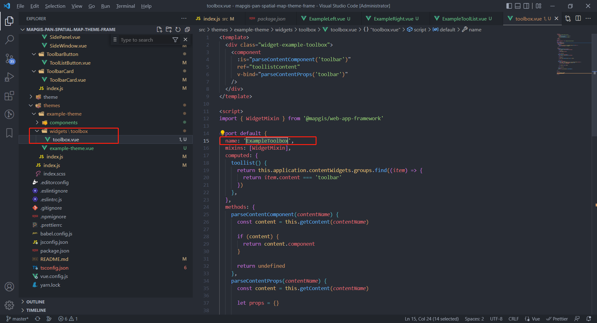

# 主题规范

主题是一个用户界面元素集合，它定义了 App 的外观，布局，app 导航，和 map 上基础 UI 组件（比如：比例尺、鹰眼图等）。
通过主题，可以打造个性化的应用界面、用户交互体验、和品牌样式。
主题元素主要包括：widget panel、style、布局。

<div style="width:100px">主题元素</div> | 定义
---|---
Panel | Panel是展示widget内容的UI窗口。可以定制特定主题上，具有特殊功能和样式的Panel。比如：你可以开发一个可以在屏幕上随意拖动，并且拥有紫色主题样式的Panel。通过主题Panel，widget开发者可以集中在开发widget内部功能，而不用担心widget怎么展示。一个主题可以包含多个Panels。
样式 | 一个主题可以包含多个样式。
布局 | 本质上来说，布局是一种规定UI元素在屏幕上的位置的app配置。

## 主题 manifest

```javascript
{
  // theme的名称
  "name": "全空间一张图经典主题",
  // theme的作者
  "author": "MapGIS",
  // theme的描述
  "description": "",
  // theme的组件名
  "component": "MpPanSpatialMapClassicTheme",

  // theme的样式集合
  "styles": [
    {
      // 样式名称
      "name": "dust-red",
      // 样式描述
      "description": "薄暮",
      // 主题颜色
      "color": "#f5222d",
      // 主题，描述布局、模式等
      "theme": "dark"
    },
    {
      "name": "volcano",
      "description": "火山",
      "color": "#fa541c",
      "theme": "dark"
    },
    {
      "name": "sunrise-yellow",
      "description": "日出",
      "color": "#fadb14",
      "theme": "dark"
    },
    {
      "name": "polar-green",
      "description": "极光绿",
      "color": "#3eaf7c",
      "theme": "dark"
    },
    {
      "name": "cyan",
      "description": "明青",
      "color": "#13c2c2",
      "theme": "dark"
    },
    {
      "name": "daybreak-blue",
      "description": "拂晓蓝",
      "color": "#1890ff",
      "theme": "dark"
    },
    {
      "name": "golden-purple",
      "description": "酱紫",
      "color": "#722ed1",
      "theme": "dark"
    },
    {
      "name": "magenta",
      "description": "法式洋红",
      "color": "#eb2f96",
      "theme": "dark"
    },
    {
      "name": "dark",
      "description": "暗蓝",
      "color": "#1890ff",
      "theme": "night"
    }
  ],
  // theme的布局内容区域集合，通过内容区域把widget分组
  "contents": [
    {
      // 对应的组名
      "name": "header",
      // 描述
      "description": "头部导航条",
      // 组件名称
      "component": "MpPanSpatialMapClassicHeader"
    },
    {
      "name": "toolbar",
      "description": "工具条",
      "component": "MpPanSpatialMapClassicToolbar",
      // widget最大数目，如果未设置，数目不限制
      "maxWidgets": 6
    },
    {
      "name": "left",
      "description": "左侧导航条",
      "component": "MpPanSpatialMapClassicLeft"
    },
    {
      "name": "footer",
      "description": "底部展示区域",
      "component": "MpPanSpatialMapFooter"
    }
  ]
}
```

## 主题样式

定义样式名称、描述和背景、字体。其中 color 指向主题颜色， theme 指向主题风格，这里的样式 name，会在 App 的配置 config.json 中用到。

## 主题内容区域

一个主题布局内部可能有多个内容区域，每个内容区域都可以放置多个 widget，来进行导航，可设置最大的 widget 数目，内容区域与在 App 的配置 app.json 中 contentWidgets.groups 下同名的组对应。

```javascript
// 比如manifest定义的content为launch，它将会对contentWidgets.groups下content名为launch的组提供导航能力
// themes/launchpad-theme/manifest.json
{
  ...
  "contents": [
    {
      // 对应的组名
      "name": "toolbar",
    }
  ]
  ...
}
```

```javascript
// 应用app.json
{
  ...
  // 内容widgets，由布局的内容区域去使用
  "contentWidgets": {
  // 内容widgets分为多组，每组对应布局中的一个内容区域（主题manifest.json中的contents）
    "groups": [
      {
        // 组名
        "content": "toolbar",
        ...
      }
    ]
   }
  ...
}
```

同时也可以设置此区域内的 widget 结构，用于分组，可用于菜单和扩展列表。

```javascript
// 可选，定义widget结构，用于分类，形成菜单或扩展项
"widgetStructure": [
  {
    "id": "widget_2"
  },
  {
    "id": "folder_1",

    // 可选，类型：folder，默认为widget
    "type": "folder",

    // 图标
    "icon": "",

    // 名称
    "label": "",

    // 子widgets
    "children": [
      {
        "id": "widget_3"
      },
      {
        "id": "folder_1_1",
        "type": "folder",
        "icon": "",
        "label": "",

        "children": [
          {
            "id": "widget_4"
          }
        ]
      }
    ]
  }
],
```

以上会形成类似下面这样的结构，在设计器没有支持组编辑之前，只能通过手动修改文件。

```text
widget_2 | folder_1
           ── widget_3
           ── folder_1_1
              ── widget_4
```

## 布局

布局是一个模板配置文件。虽然它和 app 的 config 文件使用一样的格式，但是它只是一个子集。

在布局中，使用 URI 和位置属性来定义 mapWidgets，使用 URL 来定义 contentWidgets。

那些只包含位置属性且定义了 placeholder 为 true 的 widget 被叫做占位空间，当配置的时候它允许加入一个 widget。

- **mapWidgets**: 地图 widgets，都是相对于 map 的，可以定义占位空间，对于 off-panel，设计器可以设置 visible，可以进行拖动（只要 dragble 不为 false）。
- **contentWidgets**：内容 widgets，用来供页面导航使用，加入的 widget 必须以 group 的形式存在，添加到布局的 content 中。

```javascript
{
  "mapWidgets": {
    "widgets": [
      // 默认该主题布局配置了地图模式切换按钮，在地图容器的左下角，距离左边10px，距离下边36px
      {
        "uri": "widgets/map-mode-picker",
        "position": {
          "anchor": "bottom-left",
          "horizontalOffset": 10,
          "verticalOffset": 36
        }
      },
      // 默认该主题布局配置了缩放按钮，在地图容器的左下角，距离左边10px，距离下边78px
      {
        "uri": "widgets/zoom",
        "position": {
          "anchor": "bottom-left",
          "horizontalOffset": 10,
          "verticalOffset": 78
        }
      },
      // 默认该主题布局配置了比例尺，在地图容器的右下角
      {
        "uri": "widgets/legend",
        "position": {
          "anchor": "bottom-right",
          "horizontalOffset": 10,
          "verticalOffset": 0
        }
      },
      // 默认该主题布局配置了综合查询，在地图容器的左下角
      {
        "uri": "widgets/comprehensive-query",
        "position": {
          "anchor": "top-left",
          "horizontalOffset": 10,
          "verticalOffset": 10
        }
      },
      // 下面5个是占位空间
      {
        "position": {
          "anchor": "top-left",
          "horizontalOffset": 10,
          "verticalOffset": 52
        },
        "placeholder": true
      },
      {
        "position": {
          "anchor": "top-left",
          "horizontalOffset": 52,
          "verticalOffset": 52
        },
        "placeholder": true
      },
      {
        "position": {
          "anchor": "top-left",
          "horizontalOffset": 94,
          "verticalOffset": 52
        },
        "placeholder": true
      },
      {
        "position": {
          "anchor": "top-left",
          "horizontalOffset": 136,
          "verticalOffset": 52
        },
        "placeholder": true
      },
      {
        "position": {
          "anchor": "top-left",
          "horizontalOffset": 178,
          "verticalOffset": 52
        },
        "placeholder": true
      }
    ]
  },

  "contentWidgets": {
    "groups": [
      {
        "content": "header",
        "widgets": []
      },
      {
        "content": "left",
        "widgets": [],
        "panel": {
          "relativeTo": "content"
        }
      },
      {
        "content": "toolbar",
        "widgets": []
      }
    ]
  }
}

```

## app.json

```javascript
// 这个文件描述应用配置信息
{
  // 可选，应用logo，默认值为images/app-logo.svg
  "logo": "images/logo.png",
  // 可选，应用标题
  "title": "MapGIS全空间一张图",
  // 可选，应用副标题
  "subtitle": "",

  //可选. 应用包含的外链列表
  "links": [
    {
      "url": "http://www.smaryun.com",
      "label": "MapGIS Cloud"
    }
  ],

  // 必须，主题
  "theme": {
    // 主题名称，指向themes/name主题
    "name": "pan-spatial-map-classic-theme",

    // 可选，系统主题风格，如果不存在，则使用customStyle
    "style": "night",

    // 可选，自定义主题风格，必须跟style至少存在一个
    "customStyle": {
      "color": "#1890ff",
      "theme": "night"
    }
  },

  // 地图widgets
  "mapWidgets": {
    // 可选，地图上所有inPanel为true的widget所展示的面板，显示位置根据widget自动计算弹出，
    // 如果不指定，使用系统默认面板MpMapWidgetPanel
    "panel": {
      // 面板组件名
      "component": "MpMapWidgetPanel",
      // 可选，显示模式（single/multi），只有relativeTo为map才有效
      // 如果没有指定，则默认为single
      "mode": "multi"
    },

    // widget
    "widgets": [
      {
        // widgetId，builder时动态生成
        "id": "widget_1",

        // widget标识
        "uri": "widgets/scalebar",

        // 可选，如果没有设置，使用widget目录内图标（manifest.json指向的icon）
        "icon": "",

        // 可选，如果没有设置，使用widget名称（manifest.json指向的name）
        "label": "",

        // 可选，widget位置，如果没有设置，默认是相对于map的left=0，top=0
        "position": {
          // 可选，widget位置锚点，默认值为top-left，可以设置为top-right、top-left、bottom-right、bottom-left、top-center、center-right、bottom-center、center-left、center-center
          "anchor": "top-left",
          // 可选，widget水平和垂直方向偏移,默认值为0
          "horizontalOffset": 0,
          "verticalOffset": 0
        },

        // 可选，如果没有设置，默认指向widget配置config.json（只要manifest.json的hasConfig为true）
        // 如果设置为字符串，表示自定义的config的位置，例："config": "configs/Scalebar/config.json"
        // 如果设置为对象，表示本widget实际的配置参数
        "config": {},

        // 可选，表示是否在应用启动的时候打开该widget，默认值为false
        // 只有对于能够在面板中展示的widget有效
        // 如果有多个在地图上的widget设置为true，只有第一个有效
        // 如果有多个在内容区域中的widget设置为true，由内容区域决定如何去打开
        "openAtStart": true,

        // 可选，表示能否在设计器中进行位置调整，默认为true
        // 对于某些widget，只能在固定位置，需要设置为false
        "dragable": false,

        // 可选，表示是否可见，默认为true，可以通过设置其为false，来进行隐藏
        "visible": false,

        // 可选，表示是否是占位微件，默认为false，占位微件一般在主题布局中定义，在搭建时进行定义
        "placeholder": true
      }
    ]
  },

  // 内容widgets，由布局的内容区域去使用
  "contentWidgets": {
    // 内容widgets分为多组，每组对应布局中的一个内容区域（主题manifest.json中的contents）
    "groups": [
      {
        // 组名
        "content": "launch",
        // 该内容区域包含的widget集合，可以有多个，因为内容区域中的widget只要inPanel为true，
        // 就会放到面板中显示，所以不需要指定position
        "widgets": [
          {
            // widgetId，builder时动态生成
            "id": "widget_2",

            // widget标识
            "uri": "widgets/scalebar",

            // 可选，如果没有设置，使用widget目录内图标（manifest.json指向的icon）
            "icon": "",

            // 可选，如果没有设置，使用widget名称（manifest.json指向的name）
            "label": ""
          }
        ],

        // 可选，定义widget结构，用于分类，形成菜单或扩展项
        "widgetStructure": [
          {
            "id": "widget_2"
          },
          {
            "id": "folder_1",

            // 可选，类型：folder，默认为widget
            "type": "folder",

            // 图标
            "icon": "",

            // 名称
            "label": "",

            // 子widgets
            "children": [
              {
                "id": "widget_3"
              },
              {
                "id": "folder_1_1",
                "type": "folder",
                "icon": "",
                "label": "",

                "children": [
                  {
                    "id": "widget_4"
                  }
                ]
              }
            ]
          }
        ],

        // 可选，该内容区域widgets中所有inPanel为true的widget所展示的面板
        // 如果没有指定，则使用系统默认模板MpContentWidgetPanel
        "panel": {
          // 面板组件名
          "component": "MpContentWidgetPanel",
          // 可选，指定弹出面板相对的元素（map/content）
          // 如果没有指定，则默认相对于map
          "relativeTo": "content",
          // 可选，显示模式（single/multi），只有relativeTo为map才有效
          // 如果没有指定，则默认为single
          "mode": "multi",
          // 可选，面板弹出位置，只有relativeTo为map才有效
          "position": {
            // 可选，面板位置锚点，默认值为top-right，可以设置为top-right、top-left、bottom-right、bottom-left、top-center、center-right、bottom-center、center-left、center-center
            "anchor": "top-right",
            // 可选，面板水平和垂直方向偏移,默认值为0（单位：像素）
            "horizontalOffset": 0,
            "verticalOffset": 0,
            // 可选，相对于主视图顶的距离，默认值为0（单位：像素），当height没有指定，且anchor为'bottom-left', 'bottom-right', 'bottom-center'时生效
            "top": 0,
            // 可选，相对于主视图底的距离，默认值为0（单位：像素），当height没有指定，且anchor为'top-left', 'top-right', 'top-center'时生效
            "bottom": 0
          },
          // 可选，面板样式
          "styles": {
            // 可选，是否展开，当position.anchor为top-center、bottom-center、center-left、center-right、center-center时生效
            "expand": false,
            // 可选，面板内容宽度，如果没有传，可设置最小宽度和最大宽度并由内容自适应
            "width": 240,
            // 可选，面板内容高度，如果没有传，查看是否有top或bottom，如果有，将根据距离进行自适应，如果也没有，可设置最小高度和最大高度并由内容自适应
            "height": 480,
            // 可选，面板默认最小内容宽度，默认值240（单位：像素）
            "minWidth": 240,
            // 可选，面板默认最大内容宽度，默认值为100%，只支持像素单位设置
            "maxWidth": 240,
            // 可选，面板默认最小内容宽度，默认值48（单位：像素）
            "minHeight": 48,
            // 可选，面板默认最大内容宽度，默认值为100%，只支持像素单位设置
            "maxHeight": 48
          }
        }
      }
    ]
  }
}
```

# 自定义主题

主题包含主题清单和主题布局，依据上面`主题规范`，需要在 themes 下定义主题目录，提供图标、布局和清单文件，定义主题的关键在于主题的内容区域，他决定了可供配置的布局元素，需要指定 content 的名称、描述和 content 的组件名称，在布局 layout.json 可进一步描述内置的 mapWidgets 和 contentWidgets，包括微件的样式和面板的样式。

主题统一放置在 themes 文件夹下。

## 代码规范

1、可共用的组件建议提取到 src 下的 components 文件夹中提供给主题包使用，如


2、不可共用的组件建议放到对应的主题包下，如


3、主题整体结构采用 mapgis-ui-layout 组件进行布局，使用请参考[a-layout](https://1x.antdv.com/components/layout-cn/)，内部采用动态组件进行 header、left、right、footer 部分的展示，示例如下

```javascript
 <mapgis-ui-layout class="pan-spatial-map-wrapper">
    <component
      :is="headerContentComponent"
      ref="headerContent"
      v-bind="parseContentProps('header')"
    />
    <mapgis-ui-layout ref="bodyContent">
      <component
        :is="leftContentComponent"
        ref="leftContent"
        v-if="mapInitialized"
        v-bind="parseContentProps('left')"
        :widgets="left.widgets"
        @update-width="onLeftWidthUpdate"
      />
      <mapgis-ui-layout class="main-wrapper">
        <mapgis-ui-layout-content class="content-wrapper">
          <slot v-if="mapInitialized" name="map" />
        </mapgis-ui-layout-content>
        <component
          :is="footerContentComponent"
          v-bind="parseContentProps('footer')"
          :max-view-height="maxFooterHeight"
        />
      </mapgis-ui-layout>
      <mp-pan-spatial-map-side-panel-dcd
        v-if="maxSidePanelWidth && mapInitialized"
        v-bind="right.panel"
        :widgets="right.widgets"
        :max-width="maxSidePanelWidth"
        @update-widget-state="onUpdateWidgetState('right', $event)"
      />
      <component
        :is="rightContentComponent"
        ref="rightContent"
        v-bind="parseContentProps('right')"
      />
      <mp-map-container
        v-if="configInitialized"
        class="map-wrapper"
        :cesium-lib-path="publicPath + 'cesium/Cesium.js'"
        :cesium-plugin-path="publicPath + 'cesium/webclient-cesium-plugin.js'"
        :map-options="mapOptions"
      />
    </mapgis-ui-layout>
  </mapgis-ui-layout>
```

4、如果该主题有独有的微件，目前建议在对应主题下新增 widgets 包，把新增的微件放到该文件夹下导出并全局注册到 vue 实例上，然后将该微件的配置信息放到 pan-spatial-map-mock-server 中的 widgets 包下。




## 主题配置

主题配置文件（即主题默认配置）放在 pan-spatial-map-mock-server 中，可参考经典主题中的配置按实际需求自行配置，路径如下。


## 主题配置信息

**images**

主题展示图，用于在管理平台中展示(在 mock 环境下无需关注)。

**layout.json**

主题初始化的时候，会先取 layout.json

```javascript
{
  // 地图上的微件
  "mapWidgets": {
    "widgets": [
      {
        // 微件的路径
        "uri": "widgets/map-mode-picker",
        // 微件在地图上展示的位置
        "position": {
          // 微件在地图上的位置
          "anchor": "top-left",
          // 水平距离，此处意思为距离left多少px
          "horizontalOffset": 10,
          // 垂直距离，此处意思为距离top多少px
          "verticalOffset": 10
        }
      },
```

      // 地图可配置微件，该对象的数量决定地图上可配置的微件数量

{
        "position": {
          "anchor": "top-left",
          "horizontalOffset": 10,
          "verticalOffset": 52
        },
// 地图可配置微件标识
        "placeholder": true
      }

`````
    ]
  },
// 内容微件
  "contentWidgets": {
    "groups": [
      {
// header 配置
        "content": "header",
// header 微件列表
        "widgets": [],
// 用于工具栏的展示
        "widgetStructure": [],
// 打开面板位置配置
        "panel": {
          "position": {
            "anchor": "top-right",
            "horizontalOffset": 10,
            "verticalOffset": 10,
// 固定了面板的高度，距离底部 10px
            "bottom": 10
          }
        }
      },
      {
// left 配置
        "content": "left",
        "widgets": [
          {
            "id": "widget_48a29d0c-ece4-474e-9259-65b5095757e7",
            "uri": "widgets/data-catalog"
          }
        ],
        "widgetStructure": [],
        "panel": {
// 表示打开的面板是在主题布局的时候写好的组件
          "relativeTo": "content"
        }
      },
      {
// right 配置
        "content": "right",
        "widgets": [
          {
            "id": "widget_3f8667b6-71ce-492d-be6f-f8193360b4d2",
            "uri": "widgets/toolbox"
          },
          {
            "id": "widget_3e8667b6-71ce-492d-be6f-f8193360b4d2",
            "uri": "widgets/layer-list"
          }
        ],
        "widgetStructure": [],
        "panel": {
          "relativeTo": "content"
        }
      },
      {
// 工具栏
        "content": "toolbar",
        "widgets": [
          {
            "id": "widget_878815b5-3f97-4026-80a9-46e683c053b1",
            "uri": "widgets/measurement"
          },
          {
            "id": "widget_b886364f-684a-4efb-98b7-7b98418f943a",
            "uri": "widgets/basemap-manager"
          },
          {
            "id": "widget_b21e6ee1-d398-4824-a005-b9f50f7bafae",
            "uri": "widgets/split-screen"
          },
          {
            "id": "widget_83408190-a0d8-4192-969a-200c48469a52",
            "uri": "widgets/bookmark"
          },
          {
            "id": "widget_0967bc93-d737-41c2-9344-3c93540cad45",
            "uri": "widgets/marker-manager"
          },
          {
            "id": "widget_144B68C3-F095-B053-9B47-0B6DB9B7F6FE",
            "uri": "widgets/feature-query"
          },
          {
            "id": "widget_ac20c8de-b087-48e4-90ee-e9e6925ea5bf",
            "uri": "widgets/plot-manager"
          },
          {
            "id": "widget_cc4b2d79-5e88-4f10-894b-c3362a35348d",
            "uri": "widgets/plot-animation"
          },
          {
            "id": "widget_05bc8763-837b-4fd4-972e-5d8f49718d44",
            "uri": "widgets/overlay-manager"
          },
          {
            "id": "widget_a6885da5-cfc9-40b1-9324-9a1863b05e24",
            "uri": "widgets/model-flatten"
          },
          {
            "id": "widget_9e4f4ab9-8ab6-400d-ba01-7adab2963fcc",
            "uri": "widgets/vector-tile-carto"
          },
          {
            "id": "widget_8c5d3d2e-b05b-49be-a109-8e3254a9e428",
            "uri": "widgets/add-data"
          },
          {
            "id": "widget_bfe8faf2-4568-466b-98fd-877e856ccbd9",
            "uri": "widgets/retrospect"
          },
          {
            "id": "widget_59be6878-b0c1-415b-bab4-f6bd4248e980",
            "uri": "widgets/swipe"
          },
          {
            "id": "widget_98e8c014-e015-400e-8f57-b4a22606c91a",
            "uri": "widgets/func-warehouse"
          },
          {
            "id": "widget_72e58aa3-ef5a-4f9c-892d-d7c0cac782a3",
            "uri": "widgets/topology-analysis"
          },
          {
            "id": "widget_af11a3c9-c5cc-464e-acf6-d3fb24560c71",
            "uri": "widgets/network-analysis"
          },
          {
            "id": "widget_ebc4e6c1-e17a-8c5a-6d65-d7f35f1f88c4",
            "uri": "widgets/scene-setting"
          },
          {
            "id": "widget_fa2ea6fd-c838-46bc-9b89-de82fc102e67",
            "uri": "widgets/scene-roaming"
          },
          {
            "id": "widget_cad68d22-8084-4616-96f3-a9152cf23444",
            "uri": "widgets/visual-analysis"
          },
          {
            "id": "widget_10f0d71e-454c-4a05-b271-de3d86e958db",
            "uri": "widgets/visibility-analysis"
          },
          {
            "id": "widget_b446da3a-4d4d-465c-8d41-0f6822924265",
            "uri": "widgets/dynamic-section-analysis"
          },
          {
            "id": "widget_13877c46-f36f-6864-585c-64b2ec38d369",
            "uri": "widgets/profile-analysis"
          },
          {
            "id": "widget_dd8e6669-d0c3-4460-9db6-41fc4682b51e",
            "uri": "widgets/terrain-analysis"
          },
          {
            "id": "widget_f6a164fa-2ccc-439b-b493-1445fc1faba7",
            "uri": "widgets/skyline-analysis"
          },
          {
            "id": "widget_d89dd2b3-c9b0-4326-94a6-2ef1564866d9",
            "uri": "widgets/shadow-analysis"
          },
          {
            "id": "widget_5592ccaf-7357-4d9d-863c-de6de7bc129f",
            "uri": "widgets/particle-effects"
          },
          {
            "id": "widget_6863645d-d6c6-dc3e-bb11-95ce43725b62",
            "uri": "widgets/height-limited-analysis"
          },
          {
            "id": "widget_3ed34637-838e-da33-4027-24e2c4e16ebd",
            "uri": "widgets/viewpoint-manager"
          },
          {
            "id": "widget_6f3b4cda-7f02-410d-8c32-a517f5b13a94",
            "uri": "widgets/ponding-simulation"
          },
          {
            "id": "widget_41894471-62ea-F7ba-21FF-17168abd24c0",
            "uri": "widgets/buffer-analysis"
          },
          {
            "id": "widget_1de66402-bce0-7240-8278-76ba412c71c8",
            "uri": "widgets/overlay-analysis"
          },
          {
            "id": "widget_6defe53e-5265-d56f-cd73-ae2d293e47bc",
            "uri": "widgets/projector-manager"
          },
          {
            "id": "widget_0d7ba772-07ed-2e35-6069-f62cbd591f02",
            "uri": "widgets/city-grow"
          },
          {
            "id": "widget_79dd9f5e-95ad-4971-b822-520e2f721b51",
            "uri": "widgets/stratified-household"
          },
          {
            "id": "widget_5058684b-b4b3-46a1-9b59-1057dbe00c04",
            "uri": "widgets/bim-component"
          },
          {
            "id": "widget_d1a46c04-3a62-92e1-24d5-909bc46ccaa6",
            "uri": "widgets/building-grow"
          },
          {
            "id": "widget_36150f72-0612-4c58-a990-e4e19cf57dd0",
            "uri": "widgets/output-image"
          },
          {
            "id": "widget_ec89068b-ec5f-7cb6-c198-7d32141d1967",
            "uri": "widgets/rotate"
          },
          {
            "id": "widget_64c1bb37-53d1-402d-b757-9cd5ff508330",
            "uri": "widgets/model-pick"
          },
          {
            "id": "widget_fb451727-6065-4925-9482-8a838f7842b1",
            "uri": "widgets/explosion-analysis"
          }
        ],
// 工具栏分类展示
        "widgetStructure": [
          {
            "id": "widget_878815b5-3f97-4026-80a9-46e683c053b1"
          },
          {
            "id": "widget_b886364f-684a-4efb-98b7-7b98418f943a"
          },
          {
            "id": "widget_b21e6ee1-d398-4824-a005-b9f50f7bafae"
          },
          {
            "id": "widget_05bc8763-837b-4fd4-972e-5d8f49718d44"
          },
          {
            "id": "widget_ac20c8de-b087-48e4-90ee-e9e6925ea5bf"
          },
          {
            "id": "widget_cc4b2d79-5e88-4f10-894b-c3362a35348d"
          },
          {
            "id": "widget_144B68C3-F095-B053-9B47-0B6DB9B7F6FE"
          },
          {
            "id": "widget_83408190-a0d8-4192-969a-200c48469a52"
          },
          {
            "id": "widget_0967bc93-d737-41c2-9344-3c93540cad45"
          },
          {
            "id": "widget_3e8667b6-71ce-492d-be6f-f8193360b4d2"
          },
          {
            "id": "widget_9e4f4ab9-8ab6-400d-ba01-7adab2963fcc"
          },
          {
            "id": "widget_64c1bb37-53d1-402d-b757-9cd5ff508330"
          },
          {
            "id": "folder_86c9b153-0d1e-4617-2bc3-09fbae5e6715",
            "type": "folder",
            "label": "对比分析",
            "children": [
              {
                "id": "widget_8c5d3d2e-b05b-49be-a109-8e3254a9e428"
              },
              {
                "id": "widget_bfe8faf2-4568-466b-98fd-877e856ccbd9"
              },
              {
                "id": "widget_59be6878-b0c1-415b-bab4-f6bd4248e980"
              }
            ]
          },
          {
            "id": "folder_42a60a3c-ba22-03b3-de91-5c7932e45612",
            "type": "folder",
            "label": "矢量分析",
            "children": [
              {
                "id": "widget_98e8c014-e015-400e-8f57-b4a22606c91a"
              },
              {
                "id": "widget_72e58aa3-ef5a-4f9c-892d-d7c0cac782a3"
              },
              {
                "id": "widget_af11a3c9-c5cc-464e-acf6-d3fb24560c71"
              },
              {
                "id": "widget_41894471-62ea-F7ba-21FF-17168abd24c0"
              },
              {
                "id": "widget_1de66402-bce0-7240-8278-76ba412c71c8"
              }
            ]
          },
          {
            "id": "folder_566d9d41-b02d-e9a6-ab99-28ce895c91de",
            "type": "folder",
            "label": "三维分析",
            "children": [
              {
                "id": "widget_ebc4e6c1-e17a-8c5a-6d65-d7f35f1f88c4"
              },
              {
                "id": "widget_fa2ea6fd-c838-46bc-9b89-de82fc102e67"
              },
              {
                "id": "widget_cad68d22-8084-4616-96f3-a9152cf23444"
              },
              {
                "id": "widget_10f0d71e-454c-4a05-b271-de3d86e958db"
              },
              {
                "id": "widget_b446da3a-4d4d-465c-8d41-0f6822924265"
              },
              {
                "id": "widget_13877c46-f36f-6864-585c-64b2ec38d369"
              },
              {
                "id": "widget_dd8e6669-d0c3-4460-9db6-41fc4682b51e"
              },
              {
                "id": "widget_f6a164fa-2ccc-439b-b493-1445fc1faba7"
              },
              {
                "id": "widget_d89dd2b3-c9b0-4326-94a6-2ef1564866d9"
              },
              {
                "id": "widget_5592ccaf-7357-4d9d-863c-de6de7bc129f"
              },
              {
                "id": "widget_6863645d-d6c6-dc3e-bb11-95ce43725b62"
              },
              {
                "id": "widget_3ed34637-838e-da33-4027-24e2c4e16ebd"
              },
              {
                "id": "widget_6defe53e-5265-d56f-cd73-ae2d293e47bc"
              },
              {
                "id": "widget_79dd9f5e-95ad-4971-b822-520e2f721b51"
              },
              {
                "id": "widget_5058684b-b4b3-46a1-9b59-1057dbe00c04"
              },
              {
                "id": "widget_a6885da5-cfc9-40b1-9324-9a1863b05e24"
              },
              {
                "id": "widget_36150f72-0612-4c58-a990-e4e19cf57dd0"
              },
              {
                "id": "widget_fb451727-6065-4925-9482-8a838f7842b1"
              }
            ]
          },
          {
            "id": "folder_566d9d41-b02d-e9a6-ab99-28ce895c91df",
            "type": "folder",
            "label": "模拟仿真",
            "children": [
              {
                "id": "widget_6f3b4cda-7f02-410d-8c32-a517f5b13a94"
              },
              {
                "id": "widget_0d7ba772-07ed-2e35-6069-f62cbd591f02"
              },
              {
                "id": "widget_d1a46c04-3a62-92e1-24d5-909bc46ccaa6"
              }
            ]
          },
          {
            "id": "folder_25da4e23-ad4a-e0ab-a4d9-5ce97b9106d0",
            "type": "folder",
            "label": "可视化控制",
            "children": [
              {
                "id": "widget_ec89068b-ec5f-7cb6-c198-7d32141d1967"
              }
            ]
          }
        ],
// 微件面板打开位置
        "panel": {
          "position": {
            "anchor": "top-right",
            "horizontalOffset": 10,
            "verticalOffset": 52,
            "bottom": 10
          }
        }
      }
    ]
  }
}

````
**manifest.json**
​```javascript
{
  "name": "全空间一张图科技风主题",
  "author": "MapGIS",
  "description": "",
  // 主题入口文件
  "component": "MpPanSpatialMapClassicThemeDcd",
  "styles": [
    {
      "name": "dark",
      "description": "暗蓝",
      "color": "#1890ff",
      "theme": "night"
    },
    {
      "name": "dust-red",
      "description": "薄暮",
      "color": "#f5222d",
      "theme": "dark"
    },
    {
      "name": "volcano",
      "description": "火山",
      "color": "#fa541c",
      "theme": "dark"
    },
    {
      "name": "sunrise-yellow",
      "description": "日出",
      "color": "#fadb14",
      "theme": "dark"
    },
    {
      "name": "polar-green",
      "description": "极光绿",
      "color": "#3eaf7c",
      "theme": "dark"
    },
    {
      "name": "cyan",
      "description": "明青",
      "color": "#13c2c2",
      "theme": "dark"
    },
    {
      "name": "daybreak-blue",
      "description": "拂晓蓝",
      "color": "#1890ff",
      "theme": "dark"
    },
    {
      "name": "golden-purple",
      "description": "酱紫",
      "color": "#722ed1",
      "theme": "dark"
    },
    {
      "name": "magenta",
      "description": "法式洋红",
      "color": "#eb2f96",
      "theme": "dark"
    }
  ],
  // 各个部位的的配置，description目前在管理平台只识别这几个，如若修改会出现无法配置对应的微件
  "contents": [
    {
      "name": "header",
      "description": "头部导航条",
      "component": "MpPanSpatialMapClassicHeaderDcd"
    },
    {
      "name": "toolbar",
      "description": "工具条",
      "component": "MpPanSpatialMapClassicToolListDcd"
    },
    {
      "name": "left",
      "description": "左侧导航条",
      "component": "MpPanSpatialMapClassicLeftDcd",
      // 该处组件最大数量
      "maxWidgets": 1
    },
    {
      "name": "right",
      "description": "右侧导航条",
      "component": "MpPanSpatialMapClassicRightDcd"
    },
    {
      "name": "footer",
      "description": "底部展示区域",
      "component": "MpPanSpatialMapFooter"
    }
  ]
}

````

````
`````
