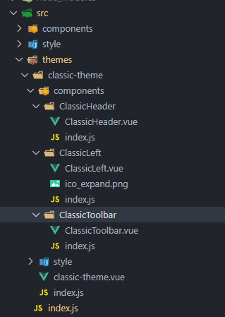

主题包含主题清单和主题布局，依据[主题规范](./主题规范.md)，需要在 themes 下定义主题目录，提供图标、布局和清单文件，定义主题的关键在于主题的内容区域，他决定了可供配置的布局元素，需要指定 content 的名称、描述和 content 的组件名称，在布局 layout.json 可进一步描述内置的 mapWidgets 和 contentWidgets，包括微件的样式和面板的样式。

主题统一放置在 themes 文件夹下。

### 组件规范

1、可共用的组件建议提取到 src 下的 components 文件夹中提供给主题包使用，如


2、不可共用的组件建议放到对应的主题包下，如



3、主题整体结构采用 mapgis-ui-layout 组件进行布局，使用请参考[a-layout](https://1x.antdv.com/components/layout-cn/)，内部采用动态组件进行 header、left、right、footer 部分的展示，示例如下

```javascript
 <mapgis-ui-layout class="pan-spatial-map-wrapper">
    <component
      :is="headerContentComponent"
      ref="headerContent"
      v-bind="parseContentProps('header')"
    />
    <mapgis-ui-layout ref="bodyContent">
      <component
        :is="leftContentComponent"
        ref="leftContent"
        v-if="mapInitialized"
        v-bind="parseContentProps('left')"
        :widgets="left.widgets"
        @update-width="onLeftWidthUpdate"
      />
      <mapgis-ui-layout class="main-wrapper">
        <mapgis-ui-layout-content class="content-wrapper">
          <slot v-if="mapInitialized" name="map" />
        </mapgis-ui-layout-content>
        <component
          :is="footerContentComponent"
          v-bind="parseContentProps('footer')"
          :max-view-height="maxFooterHeight"
        />
      </mapgis-ui-layout>
      <mp-pan-spatial-map-side-panel-dcd
        v-if="maxSidePanelWidth && mapInitialized"
        v-bind="right.panel"
        :widgets="right.widgets"
        :max-width="maxSidePanelWidth"
        @update-widget-state="onUpdateWidgetState('right', $event)"
      />
      <component
        :is="rightContentComponent"
        ref="rightContent"
        v-bind="parseContentProps('right')"
      />
      <mp-map-container
        v-if="configInitialized"
        class="map-wrapper"
        :cesium-lib-path="publicPath + 'cesium/Cesium.js'"
        :cesium-plugin-path="publicPath + 'cesium/webclient-cesium-plugin.js'"
        :map-options="mapOptions"
      />
    </mapgis-ui-layout>
  </mapgis-ui-layout>
```

4、如果该主题有独有的微件，目前建议在对应主题下新增 widgets 包，把新增的微件放到该文件夹下导出并全局注册到 vue 实例上，然后将该微件的配置信息放到 pan-spatial-map-mock-server 中的 widgets 包下。


### 主题配置

主题配置文件（即主题默认配置）放在 pan-spatial-map-mock-server 中，可参考经典主题中的配置按实际需求自行配置，路径如下。


### 主题配置信息

微件配置信息

**manifest.json**

```javascript
{
  // 微件名称
  "name": "关于",
  // 微件作者
  "author": "MapGIS",
  // 微件描述
  "description": "",
  // 组件名
  "component": "MpAbout",
  // 微件图标
  "icon": "<svg class=\"icon\" viewBox=\"0 0 1024 1024\" xmlns=\"http://www.w3.org/2000/svg\" width=\"200\" height=\"200\"><defs><style/></defs><path d=\"M512.931 27.694c-272.167 0-492.8 218.436-492.8 487.891 0 269.456 220.633 487.876 492.8 487.876 272.166 0 492.8-218.42 492.8-487.876-.001-269.455-220.634-487.891-492.8-487.891zm-.653 882.593c-219.298 0-397.059-176.005-397.059-393.119 0-217.099 177.761-393.104 397.059-393.104 219.282 0 397.059 176.005 397.059 393.104 0 217.114-177.776 393.119-397.059 393.119zm-.062-493.116c-26.325 0-47.668 21.146-47.668 47.209l.171 287.621c0 26.078 21.358 47.209 47.684 47.209 26.342 0 47.685-21.131 47.685-47.209l-.171-287.621c-.001-26.064-21.344-47.209-47.701-47.209zm0-171.241c-28.281 0-51.223 22.713-51.223 50.729l.187 1.521c0 28.015 22.942 50.729 51.239 50.729s51.239-22.714 51.239-50.729l-.187-1.521c0-28.016-22.942-50.729-51.255-50.729z\"/></svg>",
  // 微件的属性
  "properties": {
  // 二维下是否展示
    "2D": true,
  // 三维下是否展示
    "3D": true,
  // 是否有展示面板
    "inPanel": true,
  // 是否有配置文件
    "hasConfig": true,
  // 是否有配置页面
    "hasSettingPage": true,
  // 配置页组件名
    "settingUiComponent": ""
  }
}
```

**config.json**
放置微件的初始化配置信息，如果 hasConfig 为 fasle 时则无需该文件

主题配置信息

**images**

主题展示图，用于在管理平台中展示

**layout.json**

```javascript
{
  // 地图上的微件
  "mapWidgets": {
    "widgets": [
      {
        // 微件的路径
        "uri": "widgets/map-mode-picker",
        // 微件在地图上展示的位置
        "position": {
          // 微件在地图上的位置
          "anchor": "top-left",
          // 水平距离，此处意思为距离left多少px
          "horizontalOffset": 10,
          // 垂直距离，此处意思为距离top多少px
          "verticalOffset": 10
        }
      },
```

      // 地图可配置微件，该对象的数量决定地图上可配置的微件数量

{
        "position": {
          "anchor": "top-left",
          "horizontalOffset": 10,
          "verticalOffset": 52
        },
// 地图可配置微件标识
        "placeholder": true
      }

`````
    ]
  },
// 内容微件
  "contentWidgets": {
    "groups": [
      {
// header 配置
        "content": "header",
// header 微件列表
        "widgets": [],
// 用于工具栏的展示
        "widgetStructure": [],
// 打开面板位置配置
        "panel": {
          "position": {
            "anchor": "top-right",
            "horizontalOffset": 10,
            "verticalOffset": 10,
// 固定了面板的高度，距离底部 10px
            "bottom": 10
          }
        }
      },
      {
// left 配置
        "content": "left",
        "widgets": [
          {
            "id": "widget_48a29d0c-ece4-474e-9259-65b5095757e7",
            "uri": "widgets/data-catalog"
          }
        ],
        "widgetStructure": [],
        "panel": {
// 表示打开的面板是在主题布局的时候写好的组件
          "relativeTo": "content"
        }
      },
      {
// right 配置
        "content": "right",
        "widgets": [
          {
            "id": "widget_3f8667b6-71ce-492d-be6f-f8193360b4d2",
            "uri": "widgets/toolbox"
          },
          {
            "id": "widget_3e8667b6-71ce-492d-be6f-f8193360b4d2",
            "uri": "widgets/layer-list"
          }
        ],
        "widgetStructure": [],
        "panel": {
          "relativeTo": "content"
        }
      },
      {
// 工具栏
        "content": "toolbar",
        "widgets": [
          {
            "id": "widget_878815b5-3f97-4026-80a9-46e683c053b1",
            "uri": "widgets/measurement"
          },
          {
            "id": "widget_b886364f-684a-4efb-98b7-7b98418f943a",
            "uri": "widgets/basemap-manager"
          },
          {
            "id": "widget_b21e6ee1-d398-4824-a005-b9f50f7bafae",
            "uri": "widgets/split-screen"
          },
          {
            "id": "widget_83408190-a0d8-4192-969a-200c48469a52",
            "uri": "widgets/bookmark"
          },
          {
            "id": "widget_0967bc93-d737-41c2-9344-3c93540cad45",
            "uri": "widgets/marker-manager"
          },
          {
            "id": "widget_144B68C3-F095-B053-9B47-0B6DB9B7F6FE",
            "uri": "widgets/feature-query"
          },
          {
            "id": "widget_ac20c8de-b087-48e4-90ee-e9e6925ea5bf",
            "uri": "widgets/plot-manager"
          },
          {
            "id": "widget_cc4b2d79-5e88-4f10-894b-c3362a35348d",
            "uri": "widgets/plot-animation"
          },
          {
            "id": "widget_05bc8763-837b-4fd4-972e-5d8f49718d44",
            "uri": "widgets/overlay-manager"
          },
          {
            "id": "widget_a6885da5-cfc9-40b1-9324-9a1863b05e24",
            "uri": "widgets/model-flatten"
          },
          {
            "id": "widget_9e4f4ab9-8ab6-400d-ba01-7adab2963fcc",
            "uri": "widgets/vector-tile-carto"
          },
          {
            "id": "widget_8c5d3d2e-b05b-49be-a109-8e3254a9e428",
            "uri": "widgets/add-data"
          },
          {
            "id": "widget_bfe8faf2-4568-466b-98fd-877e856ccbd9",
            "uri": "widgets/retrospect"
          },
          {
            "id": "widget_59be6878-b0c1-415b-bab4-f6bd4248e980",
            "uri": "widgets/swipe"
          },
          {
            "id": "widget_98e8c014-e015-400e-8f57-b4a22606c91a",
            "uri": "widgets/func-warehouse"
          },
          {
            "id": "widget_72e58aa3-ef5a-4f9c-892d-d7c0cac782a3",
            "uri": "widgets/topology-analysis"
          },
          {
            "id": "widget_af11a3c9-c5cc-464e-acf6-d3fb24560c71",
            "uri": "widgets/network-analysis"
          },
          {
            "id": "widget_ebc4e6c1-e17a-8c5a-6d65-d7f35f1f88c4",
            "uri": "widgets/scene-setting"
          },
          {
            "id": "widget_fa2ea6fd-c838-46bc-9b89-de82fc102e67",
            "uri": "widgets/scene-roaming"
          },
          {
            "id": "widget_cad68d22-8084-4616-96f3-a9152cf23444",
            "uri": "widgets/visual-analysis"
          },
          {
            "id": "widget_10f0d71e-454c-4a05-b271-de3d86e958db",
            "uri": "widgets/visibility-analysis"
          },
          {
            "id": "widget_b446da3a-4d4d-465c-8d41-0f6822924265",
            "uri": "widgets/dynamic-section-analysis"
          },
          {
            "id": "widget_13877c46-f36f-6864-585c-64b2ec38d369",
            "uri": "widgets/profile-analysis"
          },
          {
            "id": "widget_dd8e6669-d0c3-4460-9db6-41fc4682b51e",
            "uri": "widgets/terrain-analysis"
          },
          {
            "id": "widget_f6a164fa-2ccc-439b-b493-1445fc1faba7",
            "uri": "widgets/skyline-analysis"
          },
          {
            "id": "widget_d89dd2b3-c9b0-4326-94a6-2ef1564866d9",
            "uri": "widgets/shadow-analysis"
          },
          {
            "id": "widget_5592ccaf-7357-4d9d-863c-de6de7bc129f",
            "uri": "widgets/particle-effects"
          },
          {
            "id": "widget_6863645d-d6c6-dc3e-bb11-95ce43725b62",
            "uri": "widgets/height-limited-analysis"
          },
          {
            "id": "widget_3ed34637-838e-da33-4027-24e2c4e16ebd",
            "uri": "widgets/viewpoint-manager"
          },
          {
            "id": "widget_6f3b4cda-7f02-410d-8c32-a517f5b13a94",
            "uri": "widgets/ponding-simulation"
          },
          {
            "id": "widget_41894471-62ea-F7ba-21FF-17168abd24c0",
            "uri": "widgets/buffer-analysis"
          },
          {
            "id": "widget_1de66402-bce0-7240-8278-76ba412c71c8",
            "uri": "widgets/overlay-analysis"
          },
          {
            "id": "widget_6defe53e-5265-d56f-cd73-ae2d293e47bc",
            "uri": "widgets/projector-manager"
          },
          {
            "id": "widget_0d7ba772-07ed-2e35-6069-f62cbd591f02",
            "uri": "widgets/city-grow"
          },
          {
            "id": "widget_79dd9f5e-95ad-4971-b822-520e2f721b51",
            "uri": "widgets/stratified-household"
          },
          {
            "id": "widget_5058684b-b4b3-46a1-9b59-1057dbe00c04",
            "uri": "widgets/bim-component"
          },
          {
            "id": "widget_d1a46c04-3a62-92e1-24d5-909bc46ccaa6",
            "uri": "widgets/building-grow"
          },
          {
            "id": "widget_36150f72-0612-4c58-a990-e4e19cf57dd0",
            "uri": "widgets/output-image"
          },
          {
            "id": "widget_ec89068b-ec5f-7cb6-c198-7d32141d1967",
            "uri": "widgets/rotate"
          },
          {
            "id": "widget_64c1bb37-53d1-402d-b757-9cd5ff508330",
            "uri": "widgets/model-pick"
          },
          {
            "id": "widget_fb451727-6065-4925-9482-8a838f7842b1",
            "uri": "widgets/explosion-analysis"
          }
        ],
// 工具栏分类展示
        "widgetStructure": [
          {
            "id": "widget_878815b5-3f97-4026-80a9-46e683c053b1"
          },
          {
            "id": "widget_b886364f-684a-4efb-98b7-7b98418f943a"
          },
          {
            "id": "widget_b21e6ee1-d398-4824-a005-b9f50f7bafae"
          },
          {
            "id": "widget_05bc8763-837b-4fd4-972e-5d8f49718d44"
          },
          {
            "id": "widget_ac20c8de-b087-48e4-90ee-e9e6925ea5bf"
          },
          {
            "id": "widget_cc4b2d79-5e88-4f10-894b-c3362a35348d"
          },
          {
            "id": "widget_144B68C3-F095-B053-9B47-0B6DB9B7F6FE"
          },
          {
            "id": "widget_83408190-a0d8-4192-969a-200c48469a52"
          },
          {
            "id": "widget_0967bc93-d737-41c2-9344-3c93540cad45"
          },
          {
            "id": "widget_3e8667b6-71ce-492d-be6f-f8193360b4d2"
          },
          {
            "id": "widget_9e4f4ab9-8ab6-400d-ba01-7adab2963fcc"
          },
          {
            "id": "widget_64c1bb37-53d1-402d-b757-9cd5ff508330"
          },
          {
            "id": "folder_86c9b153-0d1e-4617-2bc3-09fbae5e6715",
            "type": "folder",
            "label": "对比分析",
            "children": [
              {
                "id": "widget_8c5d3d2e-b05b-49be-a109-8e3254a9e428"
              },
              {
                "id": "widget_bfe8faf2-4568-466b-98fd-877e856ccbd9"
              },
              {
                "id": "widget_59be6878-b0c1-415b-bab4-f6bd4248e980"
              }
            ]
          },
          {
            "id": "folder_42a60a3c-ba22-03b3-de91-5c7932e45612",
            "type": "folder",
            "label": "矢量分析",
            "children": [
              {
                "id": "widget_98e8c014-e015-400e-8f57-b4a22606c91a"
              },
              {
                "id": "widget_72e58aa3-ef5a-4f9c-892d-d7c0cac782a3"
              },
              {
                "id": "widget_af11a3c9-c5cc-464e-acf6-d3fb24560c71"
              },
              {
                "id": "widget_41894471-62ea-F7ba-21FF-17168abd24c0"
              },
              {
                "id": "widget_1de66402-bce0-7240-8278-76ba412c71c8"
              }
            ]
          },
          {
            "id": "folder_566d9d41-b02d-e9a6-ab99-28ce895c91de",
            "type": "folder",
            "label": "三维分析",
            "children": [
              {
                "id": "widget_ebc4e6c1-e17a-8c5a-6d65-d7f35f1f88c4"
              },
              {
                "id": "widget_fa2ea6fd-c838-46bc-9b89-de82fc102e67"
              },
              {
                "id": "widget_cad68d22-8084-4616-96f3-a9152cf23444"
              },
              {
                "id": "widget_10f0d71e-454c-4a05-b271-de3d86e958db"
              },
              {
                "id": "widget_b446da3a-4d4d-465c-8d41-0f6822924265"
              },
              {
                "id": "widget_13877c46-f36f-6864-585c-64b2ec38d369"
              },
              {
                "id": "widget_dd8e6669-d0c3-4460-9db6-41fc4682b51e"
              },
              {
                "id": "widget_f6a164fa-2ccc-439b-b493-1445fc1faba7"
              },
              {
                "id": "widget_d89dd2b3-c9b0-4326-94a6-2ef1564866d9"
              },
              {
                "id": "widget_5592ccaf-7357-4d9d-863c-de6de7bc129f"
              },
              {
                "id": "widget_6863645d-d6c6-dc3e-bb11-95ce43725b62"
              },
              {
                "id": "widget_3ed34637-838e-da33-4027-24e2c4e16ebd"
              },
              {
                "id": "widget_6defe53e-5265-d56f-cd73-ae2d293e47bc"
              },
              {
                "id": "widget_79dd9f5e-95ad-4971-b822-520e2f721b51"
              },
              {
                "id": "widget_5058684b-b4b3-46a1-9b59-1057dbe00c04"
              },
              {
                "id": "widget_a6885da5-cfc9-40b1-9324-9a1863b05e24"
              },
              {
                "id": "widget_36150f72-0612-4c58-a990-e4e19cf57dd0"
              },
              {
                "id": "widget_fb451727-6065-4925-9482-8a838f7842b1"
              }
            ]
          },
          {
            "id": "folder_566d9d41-b02d-e9a6-ab99-28ce895c91df",
            "type": "folder",
            "label": "模拟仿真",
            "children": [
              {
                "id": "widget_6f3b4cda-7f02-410d-8c32-a517f5b13a94"
              },
              {
                "id": "widget_0d7ba772-07ed-2e35-6069-f62cbd591f02"
              },
              {
                "id": "widget_d1a46c04-3a62-92e1-24d5-909bc46ccaa6"
              }
            ]
          },
          {
            "id": "folder_25da4e23-ad4a-e0ab-a4d9-5ce97b9106d0",
            "type": "folder",
            "label": "可视化控制",
            "children": [
              {
                "id": "widget_ec89068b-ec5f-7cb6-c198-7d32141d1967"
              }
            ]
          }
        ],
// 微件面板打开位置
        "panel": {
          "position": {
            "anchor": "top-right",
            "horizontalOffset": 10,
            "verticalOffset": 52,
            "bottom": 10
          }
        }
      }
    ]
  }
}

````
**manifest.json**
​```javascript
{
  "name": "全空间一张图科技风主题",
  "author": "MapGIS",
  "description": "",
  // 主题入口文件
  "component": "MpPanSpatialMapClassicThemeDcd",
  "styles": [
    {
      "name": "dark",
      "description": "暗蓝",
      "color": "#1890ff",
      "theme": "night"
    },
    {
      "name": "dust-red",
      "description": "薄暮",
      "color": "#f5222d",
      "theme": "dark"
    },
    {
      "name": "volcano",
      "description": "火山",
      "color": "#fa541c",
      "theme": "dark"
    },
    {
      "name": "sunrise-yellow",
      "description": "日出",
      "color": "#fadb14",
      "theme": "dark"
    },
    {
      "name": "polar-green",
      "description": "极光绿",
      "color": "#3eaf7c",
      "theme": "dark"
    },
    {
      "name": "cyan",
      "description": "明青",
      "color": "#13c2c2",
      "theme": "dark"
    },
    {
      "name": "daybreak-blue",
      "description": "拂晓蓝",
      "color": "#1890ff",
      "theme": "dark"
    },
    {
      "name": "golden-purple",
      "description": "酱紫",
      "color": "#722ed1",
      "theme": "dark"
    },
    {
      "name": "magenta",
      "description": "法式洋红",
      "color": "#eb2f96",
      "theme": "dark"
    }
  ],
  // 各个部位的的配置，description目前在管理平台只识别这几个，如若修改会出现无法配置对应的微件
  "contents": [
    {
      "name": "header",
      "description": "头部导航条",
      "component": "MpPanSpatialMapClassicHeaderDcd"
    },
    {
      "name": "toolbar",
      "description": "工具条",
      "component": "MpPanSpatialMapClassicToolListDcd"
    },
    {
      "name": "left",
      "description": "左侧导航条",
      "component": "MpPanSpatialMapClassicLeftDcd",
      // 该处组件最大数量
      "maxWidgets": 1
    },
    {
      "name": "right",
      "description": "右侧导航条",
      "component": "MpPanSpatialMapClassicRightDcd"
    },
    {
      "name": "footer",
      "description": "底部展示区域",
      "component": "MpPanSpatialMapFooter"
    }
  ]
}

````

````
`````
